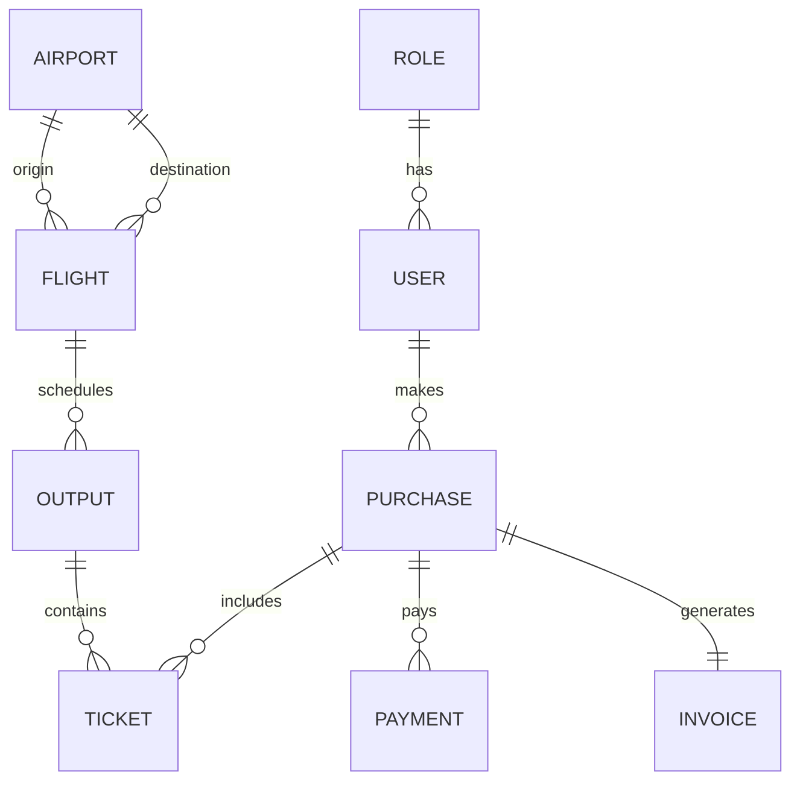

# Modelo de datos

## Modelo conceptual

- Aeropuerto: identifica un punto geográfico operado por la aerolínea. Tiene IATA, nombre, ciudad y provincia.
- Usuario: representa un usuario autenticado con un rol concreto. Los roles previstos son administrador, empleado de mostrador y pasajero.
- Vuelo: es la programación con días de operación, horarios, ruta, período disponible, capacidad y precios por clase.
- Salida: es la ejecución del vuelo en una fecha específica. La disponibilidad y ocupación se resuelven por salida.
- Compra: registra la transacción de pasajes asociados a una salida y clase.
- Pasaje: vincula una compra con una salida y una clase determinada.

## Modelo lógico

- `roles(id, name)`
- `users(id, name, email, password_hash, role_id, is_active, created_at, updated_at)`
- `airports(id, iata, name, city, province, is_active, created_at, updated_at)`
- `flights(id, flight_number, days_of_week, departure_time, arrival_time, origin_airport_id, destination_airport_id, available_from, available_to, economy_seats, first_class_seats, economy_price, first_class_price, status, created_at, updated_at)`
- `flight_outputs(id, flight_id, output_date, status, created_at, updated_at)`
- `purchases(id, user_id, status, created_at, updated_at)`
- `tickets(id, purchase_id, output_id, class_type, price, status, created_at)`
- `payments(id, purchase_id, amount, status, created_at)`
- `invoices(id, purchase_id, total, issued_at)`

## Modelo físico

- Base de datos SQLite con Sequelize.
- Índices por `iata`, `flight_number`, `email`, `role_id`, `origin_airport_id`, `destination_airport_id` y `output_date`.
- Restricciones: IATA único y en formato 3 letras; número de vuelo único; cada usuario tiene un rol válido; cada aeropuerto activo debe ser distinto al origen y destino de vuelos activos al desactivar.
- Scripts disponibles: `npm --prefix backend run db:reset` recrea el esquema y vuelve a sembrar datos.

## Diagrama ER

## Diccionario de datos

| Entidad | Campo | Tipo | Descripción |
| --- | --- | --- | --- |
| users | email | texto | Email único del usuario autenticado. |
| airports | iata | texto | Código IATA de 3 letras. |
| flights | days_of_week | texto | Días de operación del vuelo, serializados como lista. |
| flights | status | texto | Estado del vuelo: activo o cancelado. |
| flights | economy_price | decimal | Precio del pasaje en Economy. |
| outputs | status | texto | Estado de la salida: programada o cancelada. |
| purchases | status | texto | Estados permitidos: reservada, confirmada, vencida o rechazada. |

## Validación

Fecha:
Validador:
Observaciones:
