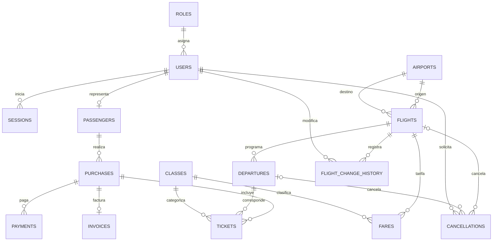

# Modelo de datos

## Modelo conceptual

- **Aeropuerto** ofrece origen y destino para vuelos; los inactivos se conservan.
- **Vuelo** es una programación con ruta, días, horarios, período, capacidad/precio por clase y estado.
- **Salida** es la operación de un vuelo en una fecha; almacena estado y ocupación por clase.
- **Clase y tarifa** clasifican Economy/Primera y asocian precio y capacidad a un vuelo.
- **Usuario, rol y sesión** representan identidad, permisos y sesión revocable con actividad deslizante.
- **Pasajero, compra, pasaje, pago y factura** representan datos de prueba del dominio de venta; no se implementa su flujo funcional en este sprint.
- **Historial de cambios** y **cancelación** conservan quién hizo el cambio, cuándo y qué valores o elementos afectó.

## Modelo lógico

Las tablas y nombres siguientes coinciden con SQLite/Sequelize:

`roles`, `users`, `sessions`, `airports`, `flights`, `departures`, `classes`, `fares`, `passengers`, `purchases`, `tickets` (pasajes), `payments`, `invoices`, `flight_change_history`, `cancellations`.

Relaciones principales: rol 1:N usuario; usuario 1:N sesión; aeropuerto 1:N vuelo (origen/destino); vuelo 1:N salida e historial; vuelo N:M clase mediante tarifa; usuario 0:1 pasajero; pasajero 1:N compra; compra 1:N pasaje/pago y 1:0..1 factura; pasaje refiere a una salida y una clase; cancelación refiere a vuelo o salida.

## Modelo físico

- SQLite administrado por Sequelize; `npm run db:reset` recrea y vuelve a poblar el esquema.
- Claves primarias enteras autoincrementales, salvo `sessions.id` (UUID string); relaciones implementadas con claves foráneas.
- Índices: únicos de `roles.name`, `users.email`, `airports.iata`, `flights.flightNumber`, `departures(flightId,date)`, `fares(flightId,classId)`, `passengers.userId`, `passengers.documentNumber`, `invoices.purchaseId`, `invoices.number`; índices de vuelos por estado, ruta y horario; salidas por fecha/estado.
- Estados de dominio: `DataTypes.ENUM` de Sequelize. SQLite no genera un `CHECK` para `ENUM`, por eso `ensureStateConstraints()` instala triggers de inserción y actualización para impedir estados ajenos a las listas permitidas.
- Los estados persistidos son `ACTIVE/CANCELLED` (vuelo), `SCHEDULED/CANCELLED` (salida) y `RESERVED/CONFIRMED/EXPIRED/REJECTED` (compra); equivalen a Activo/Cancelado, Programada/Cancelada y Reservada/Confirmada/Vencida/Rechazada.
- Capacidad y precio operativos se guardan en `flights.economySeats`, `flights.firstClassSeats`, `flights.economyPrice` y `flights.firstClassPrice`. `fares` normaliza la relación vuelo/clase y mantiene su capacidad y precio.
- `flights.history` conserva el formato consumido por el detalle; `flight_change_history` contiene el registro normalizado.
- La tabla `sessions` guarda `id`, `userId`, `lastActivity`, `revoked` y `createdAt`. El JWT porta el UUID de sesión.

## Diagrama ER

## Diccionario de datos

Tipos y nombres contrastados con `PRAGMA table_info` de la base recreada. Los campos `createdAt`/`updatedAt` son timestamps automáticos de Sequelize; `sessions` solo conserva `createdAt`.

| Tabla | Columna | Tipo SQLite | Restricción / significado |
|---|---|---|---|
| `airports` | `id` | INTEGER | PK |
| `airports` | `iata` | VARCHAR(3) | NOT NULL, UNIQUE |
| `airports` | `name` | VARCHAR(255) | NOT NULL |
| `airports` | `city` | VARCHAR(255) | NOT NULL |
| `airports` | `province` | VARCHAR(255) | NOT NULL |
| `airports` | `isActive` | TINYINT(1) | Estado lógico; default 1 |
| `airports` | `createdAt`, `updatedAt` | DATETIME | Timestamps NOT NULL |
| `roles` | `id` | INTEGER | PK |
| `roles` | `name` | VARCHAR(255) | NOT NULL, UNIQUE |
| `roles` | `createdAt`, `updatedAt` | DATETIME | Timestamps NOT NULL |
| `users` | `id` | INTEGER | PK |
| `users` | `name` | VARCHAR(255) | NOT NULL |
| `users` | `email` | VARCHAR(255) | NOT NULL, UNIQUE |
| `users` | `passwordHash` | VARCHAR(255) | Hash bcrypt NOT NULL |
| `users` | `roleId` | INTEGER | FK `roles.id`, NOT NULL |
| `users` | `isActive` | TINYINT(1) | Default 1 |
| `users` | `createdAt`, `updatedAt` | DATETIME | Timestamps NOT NULL |
| `sessions` | `id` | VARCHAR(255) | PK; UUID de sesión del JWT |
| `sessions` | `userId` | INTEGER | FK `users.id`, NOT NULL |
| `sessions` | `lastActivity` | DATETIME | Última actividad válida, NOT NULL |
| `sessions` | `revoked` | TINYINT(1) | Revocación, NOT NULL, default 0 |
| `sessions` | `createdAt` | DATETIME | Alta NOT NULL |
| `flights` | `id` | INTEGER | PK |
| `flights` | `flightNumber` | VARCHAR(255) | NOT NULL, UNIQUE |
| `flights` | `daysOfWeek` | VARCHAR(255) | Días serializados separados por coma |
| `flights` | `departureTime`, `arrivalTime` | VARCHAR(255) | Horarios HH:MM |
| `flights` | `originAirportId`, `destinationAirportId` | INTEGER | FK `airports.id`, NOT NULL |
| `flights` | `availableFrom`, `availableTo` | DATE | Período inclusivo |
| `flights` | `economySeats`, `firstClassSeats` | INTEGER | Capacidad por clase; default 0 |
| `flights` | `economyPrice`, `firstClassPrice` | DECIMAL(10,2) | Precio por clase; default 0 |
| `flights` | `status` | TEXT | `ACTIVE` o `CANCELLED`; default `ACTIVE`, trigger |
| `flights` | `cancelledAt` | DATETIME | Fecha/hora de cancelación, nullable |
| `flights` | `cancelledByUserId` | INTEGER | FK `users.id`, nullable |
| `flights` | `history` | JSON | Historial serializado para el detalle, default `[]` |
| `flights` | `createdAt`, `updatedAt` | DATETIME | Timestamps NOT NULL |
| `departures` | `id` | INTEGER | PK |
| `departures` | `flightId` | INTEGER | FK `flights.id`, NOT NULL |
| `departures` | `date` | DATE | Fecha de calendario, NOT NULL |
| `departures` | `status` | TEXT | `SCHEDULED` o `CANCELLED`; default `SCHEDULED`, trigger |
| `departures` | `soldEconomy`, `soldFirstClass` | INTEGER | Ocupación por clase, default 0 |
| `departures` | `cancelledAt` | DATETIME | Fecha/hora, nullable |
| `departures` | `cancelledByUserId` | INTEGER | FK `users.id`, nullable |
| `departures` | `createdAt`, `updatedAt` | DATETIME | Timestamps NOT NULL |
| `classes` | `id` | INTEGER | PK |
| `classes` | `code` | VARCHAR(255) | Código UNIQUE, NOT NULL |
| `classes` | `name` | VARCHAR(255) | Nombre NOT NULL |
| `classes` | `createdAt`, `updatedAt` | DATETIME | Timestamps NOT NULL |
| `fares` | `id` | INTEGER | PK |
| `fares` | `flightId`, `classId` | INTEGER | FK `flights.id` y `classes.id`, NOT NULL |
| `fares` | `price` | DECIMAL(10,2) | Precio por clase NOT NULL |
| `fares` | `capacity` | INTEGER | Capacidad por clase NOT NULL |
| `fares` | `createdAt`, `updatedAt` | DATETIME | Timestamps NOT NULL |
| `passengers` | `id` | INTEGER | PK |
| `passengers` | `userId` | INTEGER | FK `users.id`, nullable, UNIQUE |
| `passengers` | `firstName`, `lastName` | VARCHAR(255) | Nombres NOT NULL |
| `passengers` | `documentType`, `documentNumber` | VARCHAR(255) | Documento; número UNIQUE |
| `passengers` | `email` | VARCHAR(255) | Email NOT NULL |
| `passengers` | `createdAt`, `updatedAt` | DATETIME | Timestamps NOT NULL |
| `purchases` | `id` | INTEGER | PK |
| `purchases` | `passengerId` | INTEGER | FK `passengers.id`, NOT NULL |
| `purchases` | `status` | TEXT | Estados permitidos; default `RESERVED`, trigger |
| `purchases` | `total` | DECIMAL(10,2) | Total, default 0 |
| `purchases` | `createdAt`, `updatedAt` | DATETIME | Timestamps NOT NULL |
| `tickets` | `id` | INTEGER | PK |
| `tickets` | `purchaseId`, `departureId`, `classId` | INTEGER | FK a compra, salida y clase; NOT NULL |
| `tickets` | `price` | DECIMAL(10,2) | Precio vendido NOT NULL |
| `tickets` | `createdAt`, `updatedAt` | DATETIME | Timestamps NOT NULL |
| `payments` | `id` | INTEGER | PK |
| `payments` | `purchaseId` | INTEGER | FK `purchases.id`, NOT NULL |
| `payments` | `amount` | DECIMAL(10,2) | Importe NOT NULL |
| `payments` | `status` | VARCHAR(255) | Estado del pago, default `PENDING` |
| `payments` | `paidAt` | DATETIME | Fecha de pago, nullable |
| `payments` | `createdAt`, `updatedAt` | DATETIME | Timestamps NOT NULL |
| `invoices` | `id` | INTEGER | PK |
| `invoices` | `purchaseId` | INTEGER | FK `purchases.id`, UNIQUE, NOT NULL |
| `invoices` | `number` | VARCHAR(255) | Número UNIQUE, NOT NULL |
| `invoices` | `total` | DECIMAL(10,2) | Total NOT NULL |
| `invoices` | `issuedAt` | DATETIME | Emisión NOT NULL |
| `invoices` | `createdAt`, `updatedAt` | DATETIME | Timestamps NOT NULL |
| `flight_change_history` | `id` | INTEGER | PK |
| `flight_change_history` | `flightId` | INTEGER | FK `flights.id`, NOT NULL |
| `flight_change_history` | `changedAt` | DATETIME | Fecha/hora del cambio |
| `flight_change_history` | `userId` | INTEGER | FK `users.id`, NOT NULL |
| `flight_change_history` | `field` | VARCHAR(255) | Campo modificado |
| `flight_change_history` | `previousValue`, `newValue` | TEXT | Valores serializados; nullable |
| `flight_change_history` | `createdAt`, `updatedAt` | DATETIME | Timestamps NOT NULL |
| `cancellations` | `id` | INTEGER | PK |
| `cancellations` | `flightId`, `departureId` | INTEGER | FK opcional al vuelo o salida cancelados |
| `cancellations` | `cancelledAt` | DATETIME | Fecha/hora NOT NULL |
| `cancellations` | `userId` | INTEGER | FK `users.id`, NOT NULL |
| `cancellations` | `createdAt`, `updatedAt` | DATETIME | Timestamps NOT NULL |

## Validación

Fecha:
Validador:
Observaciones:
